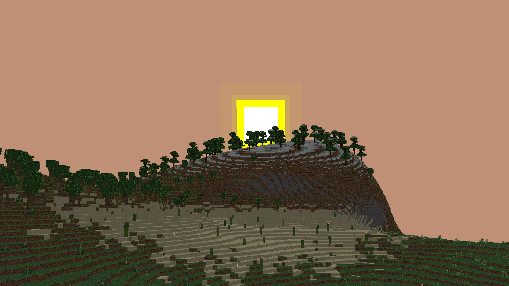
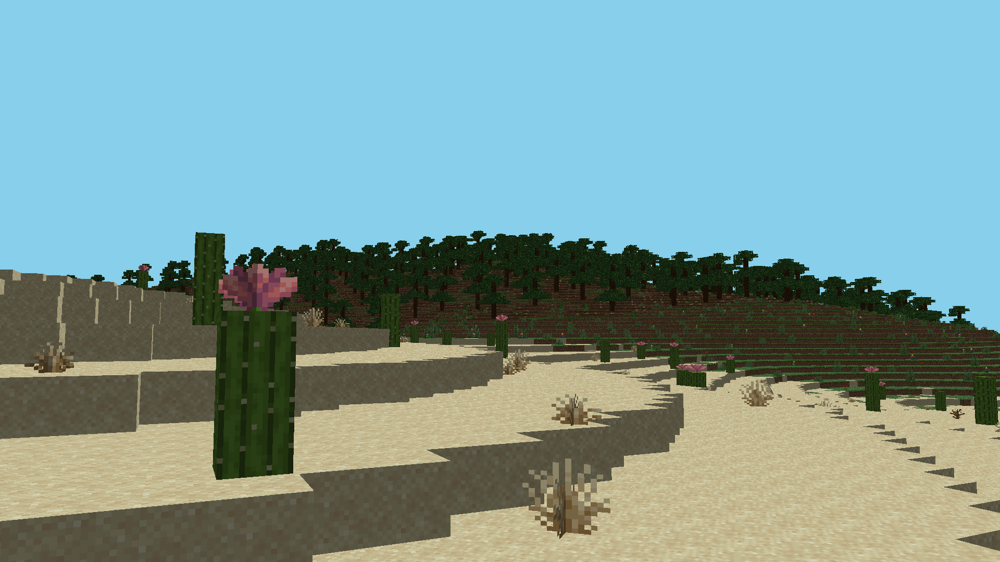
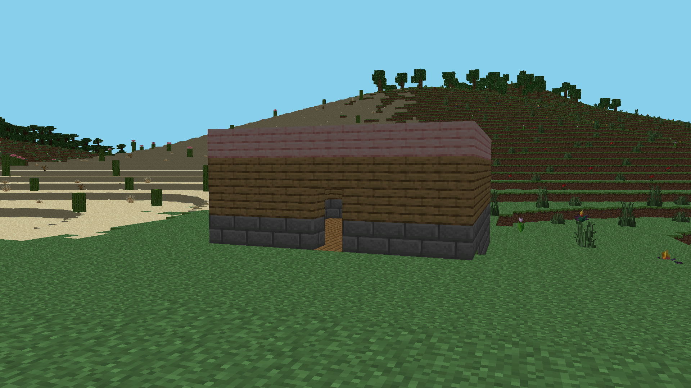

# MineCRust

A Voxel engine implementation written in Rust, featuring infinite terrain generation, world-editing, and a command system.

## Features

- **Voxel Engine**: Chunk-based rendering with efficient face-culling mesh generation.
- **Infinite Terrain**: Procedurally generated terrain with diverse biomes.
- **Dynamic Sky**: Real-time day-night cycle with sun, and moon.
- **Building System**: Place and remove blocks with support for rotation.
- **Command Interface**: Built-in command prompt for game control.
- **Lighting**: Basic lighting system affected by the day-night cycle.

## Screenshots




## Getting Started

### Prerequisites

- Rust (latest stable version)
- Cargo
- OpenGL 3.3 capable GPU
- GLFW3 development libraries (for compilation)

### Running the Game

1. Clone the repository.
2. Navigate to the project directory.
3. Run the game using Cargo:

```bash
cargo run --release
```

## Controls

### Movement
- **W, A, S, D**: Move camera
- **Space**: Fly Up
- **Left Shift**: Fly Down
- **Left Control**: Sprint (Increase speed)
- **Mouse**: Look around

### Game Modes
- **Num 1**: Normal Mode (Spectate)
- **Num 2**: Insert Mode (Block placement)
- **Num 3**: Delete Mode (Block removal)
- **Esc**: Return to Normal Mode

### Interaction
- **Right Click**: Place block (in Insert Mode)
- **Left Click**: Remove block (in Delete Mode)

### Command Prompt
- **/**: Toggle Command Prompt
- **Up/Down**: Navigate command suggestions
- **Right Arrow**: Autocomplete suggestion
- **Enter**: Execute command

### Block Selection
Set the current block type for placement.
```
use <BlockType>;
```
Example: `use Stone;`

### Time Control
Control the in-game time and day-night cycle.
```
time <argument>;
```
Arguments:
- `dawn`: Set time to dawn
- `noon`: Set time to noon
- `dusk`: Set time to dusk
- `night`: Set time to night
- `toggle`: Toggle automatic day-night cycle

### Block Rotation
Set the rotation for the next block to be placed. Values must be multiples of 90.
```
rotate <x> <y> <z>;
```
Example: `rotate 0 90 0;`

## Dependencies

- **glfw**: Window creation and input handling.
- **gl**: OpenGL bindings.
- **cgmath**: Linear algebra and math utilities.
- **noise**: Noise generation for terrain.
- **tokio**: Async runtime for multithreaded chunk generation.
